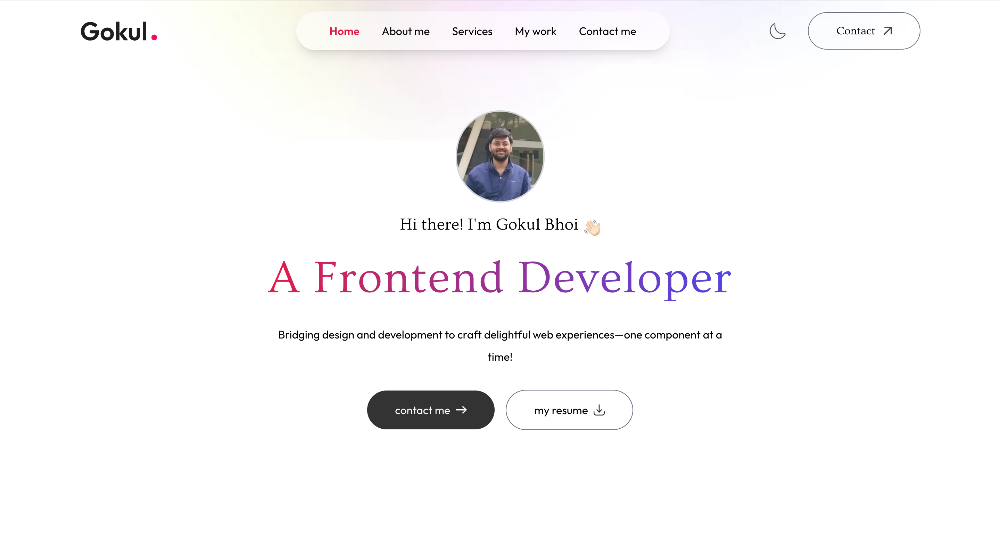
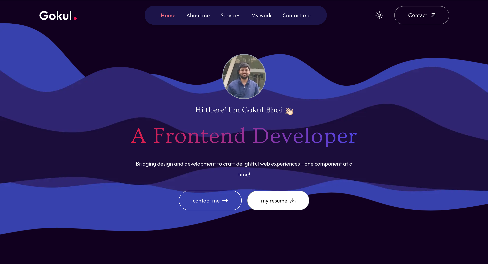
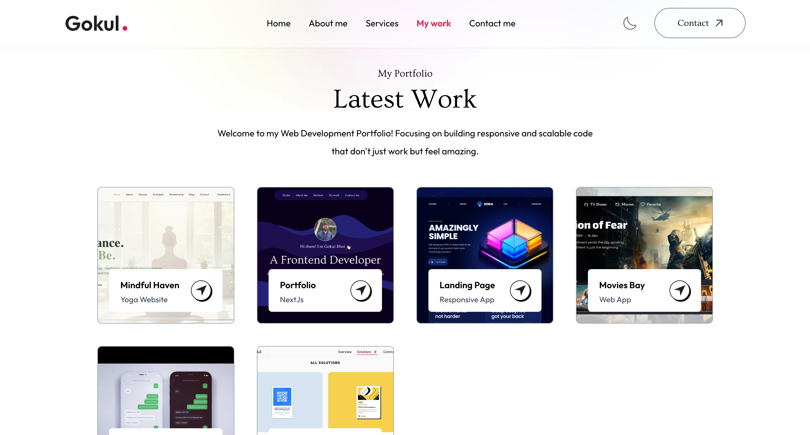

# My Portfolio

This is my portfolio website developed using Next.js and Tailwind CSS.

## Table of contents

- [Overview](#overview)
  - [Screenshots](#screenshots)
  - [Links](#links)
- [My process](#my-process)
  - [Built with](#built-with)
  - [Continued Development](#continued-development)
- [Author](#author)

## Overview

### Screenshots

1. Homepage

2. Homepage_dark_mode

3. Projects

### Links

- Live Site URL: (https://gokul-bhoi-portfolio.netlify.app/)

## My process

### Built with

- Next.js
- Tailwind CSS

### Continued development

- Thinking on implementing more animations and effects to make the website more dynamic and engaging.

## Author

- Frontend Mentor - [Gokul221](https://www.frontendmentor.io/profile/Gokul221)
- LinkedIn - [Gokul Bhoi](https://www.linkedin.com/in/gokul-bhoi-3b8b39188)
- HackerRank - [gokulbhoi](https://www.hackerrank.com/profile/gokulbhoi)
